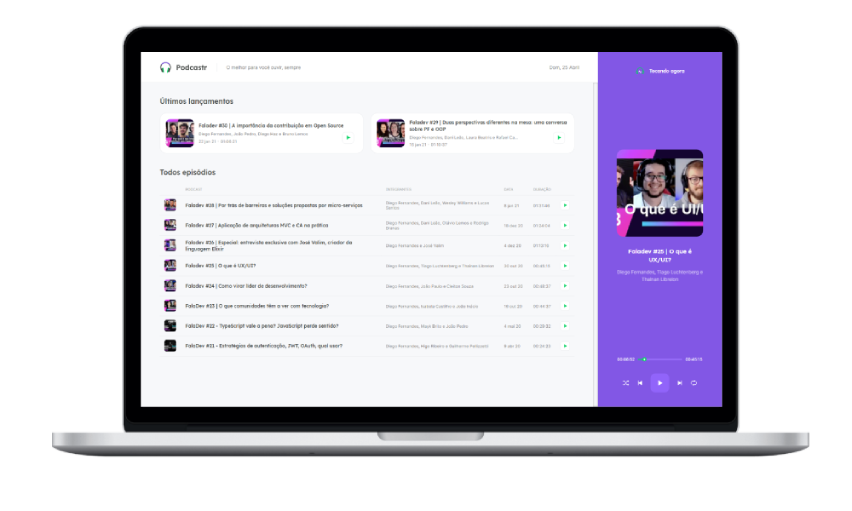

<h1 align="center">
    
</h1>

<p align="center">
  <a href="#-projeto">Projeto</a>&nbsp;&nbsp;&nbsp;|&nbsp;&nbsp;&nbsp;
  <a href="#-layout">Layout</a>&nbsp;&nbsp;&nbsp;|&nbsp;&nbsp;&nbsp;
  <a href="#-tecnologias">Tecnologias</a>&nbsp;&nbsp;&nbsp;|&nbsp;&nbsp;&nbsp;
  <a href="#-Instalação e Start">Instalação e Start</a>&nbsp;&nbsp;&nbsp;|&nbsp;&nbsp;&nbsp;
  <a href="#memo-licença">Licença</a>
</p>

<p align="center">
  
  
  
  
</p>

<br>

<p align="center">
  
</p>

## 💻 Projeto

O objetivo do Podcastr é ser um player de podcasts, que atualmente são fornecidos pela Rocketseat onde você pode ouvir podcasts e acompanhar o lançamentos de novos podcasts. Feito com as novas tecnologias de SSR e SSG.

## 🚀 Tecnologias

Esse projeto foi desenvolvido com as seguintes tecnologias:

- [ReactJS](https://reactjs.org)
- [NextJS](https://nextjs.org/)
- [TypeScript](https://www.typescriptlang.org/)

## ⚙ Instalação e Start

Este repositório é um repositorio React, porém ele consome por debaixo dos panos uma API falsa que é sustentada pelo Json server, para isso certifique-se de que tenha [NPM](https://www.npmjs.com/) ou [YARN](https://yarnpkg.com/) instalado em seu ambiente, além, é claro, o repositório clonado em seu ambiente.

Clone o repositório com:

> git clone https://github.com/Gabroiz/Podcastr.git

As demonstrações utilizam **YARN** por padronização, mas, caso use **NPM**, basta substituir onde estiver escrito `yarn` por `npm`.

```bash
# Entre na pasta do projeto
$ cd podcastr

# Instale as dependências
$ yarn install

# Inicie a API falsa
$ yarn server

# Execute a aplicação
$ yarn dev
```

Agora basta abrir [`http://localhost:3000/`](http://localhost:3333/) para ver a aplicação rodando

## :memo: Licença

Esse projeto está sob a licença MIT. Veja o arquivo [LICENSE](LICENSE) para mais detalhes.
